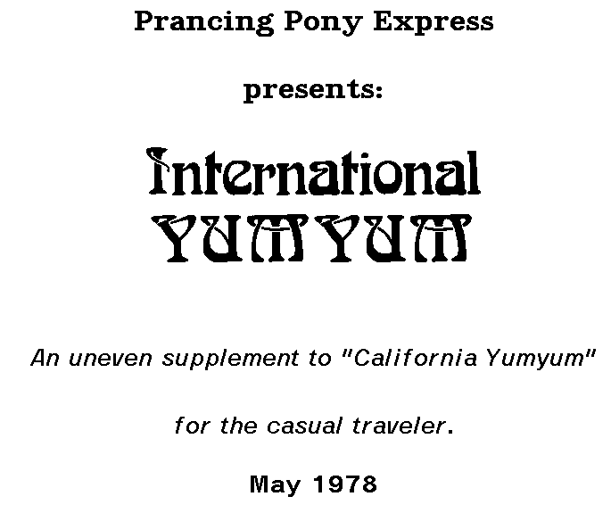

`xgptopdf` converts Stanford A.I. Lab WAITS XGP printer spool files to
PDF or text. It can take input from local files or directly from the
[saildart.org](https://saildart.org) archive. Foe example, to convert
the first version of *International YUMYUM*, the lab's guide to
restaurants from 1978, type

```
    xgptopdf YUMMY.XGP[P,DOC]1
```

and it will create a file `YUMMY.XGP[P,DOC]1.pdf` in your current directory.

<p align="center">
    
</p>

See the complete PDF, and other sample output, [here](./examples/).

## Background

The first incarnation of the Stanford University A.I. Laboratory
(SAIL) had a PDP-6/10 computer on which they created their own
time-sharing operating system, WAITS, based on an early version of
DEC's Monitor for the PDP-6. This had some interesting peripherals,
including a Xerox Graphics Printer (XGP), similar in technology to a
laser printer but using a CRT as its light source. The WAITS XGP
system could print either in graphics or text mode; `xgptopdf` only
covers text mode. In text mode you could

* select different bitmap fonts
* write text, with support for kerning, overprinting and underlining
* position items on the page with pixel accuracy
* draw simple vector graphics

Several utilities were developed for WAITS that could compose output
files for the XGP, such as [PUB](https://www.saildart.org/allow/PUB/),
[POX](https://www.saildart.org/POX.REM[UP,DOC]) and Donald Knuth's
TeX. These would create .XGP files which could be sent to the printer
when needed.

This was all taking place in the early 1970s, at least ten years
before laser printers started being used by businesses and consumers.

The [saildart.org](https://saildart.org) archive is a collection of
files from WAITS, based on a set of backup tapes dating from the early
1970s until the system was finally retired in 1991. The archivist, and
former SAIL staffer, Bruce Guenther Baumgart has created a unique
place where you can find many .XGP files created by users when WAITS
was running which can be printed by this tool.

Users of WAITS on [emulation](https://github.com/timereshared/stanford-waits-simh-quickstart)  can also create new .XGP files, export them to
their host PC via [virtual tape](https://timereshared.com/waits-getting-data-in-and-out/) and produce PDFs. This allows documents
that only exist in the source form to be printed.

## Installation

You will need Python 3.10 or later and a unix-like environment.

```
$ git clone https://github.com/timereshared/xgptopdf.git
$ cd xgptopdf
$ python3 -m venv .venv
$ source .venv/bin/activate
$ python3 -m pip install -r requirements.txt
$ ./xgptopdf -h
```

## Usage

```
Usage: xgptopdf [-hv] [-f fmt] [-F font_dir] [-O option]... input [-o output]

-v: print verbose messages about what the program is doing
-f fmt: set format for output (pdf, txt, cmd) (default pdf)
-F font_dir: where to find fonts (default ./fonts/final/)
-O options: set XGP options, each must be KEY=VAL
```

### Input

This can be

* a local file on your system
* a URL
* a saildart.org reference, eg `FAIL.XGP[AIM,DOC]`

In the first two cases, the input must contain lines of 36 bit octal
numbers representing data for a XGP file. In the last case, the
program will automatically download the octal format file from
saildart.org

### Output formats

The default output format is PDF, but you can select two others using
the `-f` flag

* `txt` will write plain text
* `cmd` will write a printable version of the commands being sent to
  the XGP, which is useful for debugging.

### Output

By default, the system will select your input file name or
saildart.org reference and add .PDF (or .TXT or .CMD if you selected a
different output format). Use `-o output_file` to override this. Use
`-o -` to send TXT or CMD output to stdout.

### Font directories

The names of which fonts to use is specified by the XGP document but
can be overridden by the user, see XGP options below.

The system includes data for many fonts from WAITS under `fonts/`. By
default, `fonts/final` will be used which contains all fonts in
`[XGP,SYS]` at the time WAITS was retired.

You can override this with the `-F font_dir` option. Setting this
to `-F fonts/1974` will provide the fonts available in the 1974
snapshot of WAITS available on simh.

If you install this program in another directory, also copy over the
`fonts/` directory beneath it, or place the fonts somewhere else and
set `-F` manually.

### XGP options

Multiple printing options can be set via `-O`. This mimics the options
available to users on WAITS running the `XSPOOL` command. Quoting from
the SPOOL manual:

```
  FONT-n=f n is a number.  f is a file  name.  The XGP  spooler  will 
           use  the  font  named f  as  font  n when spooling.
  LMAR=n   Set  left  margin  to  column n.   Columns  in  the  XGP are
           numbered from 0 to 1699 (approximately).  The left margin is
           the column which the carriage return character selects.
  RMAR=n   Set right margin to column n.  If the XGP is going  to write
           a character  that exceeds  this margin, a  new line  will be
           started.
  TMAR=n   Set the number of blank  scan lines between the top  edge of
           the page and the first line of text.
  BMAR=n   Set the number of blank scan lines between the bottom of the
           text  and  the  bottom  edge  of  the  paper. 
  PMAR=n   Set the  number of  scan lines  in the  page body.   Text is
           written inside this area. 
  XLINE=n  Set the minimum interline spacing to n scan lines.
```

`n` is an integer and `f` is a font name (like `FIX30`) or path to a
font file (like `fonts/1974/XGP/SYS/FIX30.FNT`)

The `FONT` option can be useful if a font referenced by the document
is not found and you want to substitute something else. For example, if
font 12 cannot be found and you want to use 30pt fixed instead, do

```
-O FONT-12=FIX30
```

(note it is `FONT-n` here and not `FONT#n` as on WAITS because `#` is
treated as a start of a comment by the unix shell).

`PMAR` is around 1800 normally, to fit on a 8.5" x 11" US Letter page.
But the XGP used a roll of paper and a knife to cut into pages as
instructed, so it was possible to have PMAR = 0 for an single scroll
of paper. In this case, xgptopdf forces a page break at 2800 pixels
(equivalent to US Legal) at present.

## Further information

See the following WAITS documentation:for

* the format of the XGP file in
  [SPOOL.REG](https://www.saildart.org/SPOOL.REG[UP,DOC]5)
* extensions to the XGP file used by TeX at [TEXOUT.SAI](https://www.saildart.org/TEXOUT.SAI[TEX,DEK]1).
* the XGP interface in the [UUO
  manual](https://www.saildart.org/UUO.ME[S,DOC]3)
* font format and sample fonts in
  [Find-a-font](https://www.saildart.org/allow/pdf/findafont00brucrich.pdf)

See my series of
[blog posts](https://timereshared.com/stanford-waits/)
on how to use WAITS on an emulator.

## License

Copyright 2026 Rupert Lane

GPL v3; see [COPYING.md](./COPYING.md)

This program is free software: you can redistribute it and/or modify
it under the terms of the GNU General Public License as published by
the Free Software Foundation, either version 3 of the License, or (at
your option) any later version.

This program is distributed in the hope that it will be useful, but
WITHOUT ANY WARRANTY; without even the implied warranty of
MERCHANTABILITY or FITNESS FOR A PARTICULAR PURPOSE. See the GNU
General Public License for more details.

You should have received a copy of the GNU General Public License
along with this program. If not, see <https://www.gnu.org/licenses/>.

## Questions, bugs etc

Feel free to create an issue if you spot any bugs. Pull requests are
welcome if they conform to the style and scope of the existing code;
if in doubt raise an issue first. I will do my best to support this
code but I am not planning on making any major enhancements.

You can also email me at rupert@timereshared.com with any questions or
comments.
